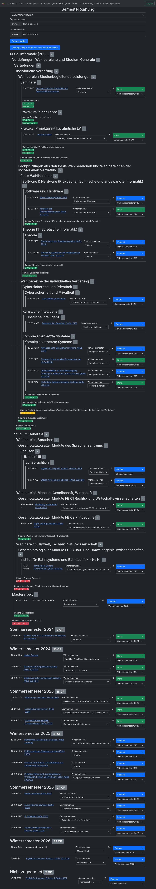
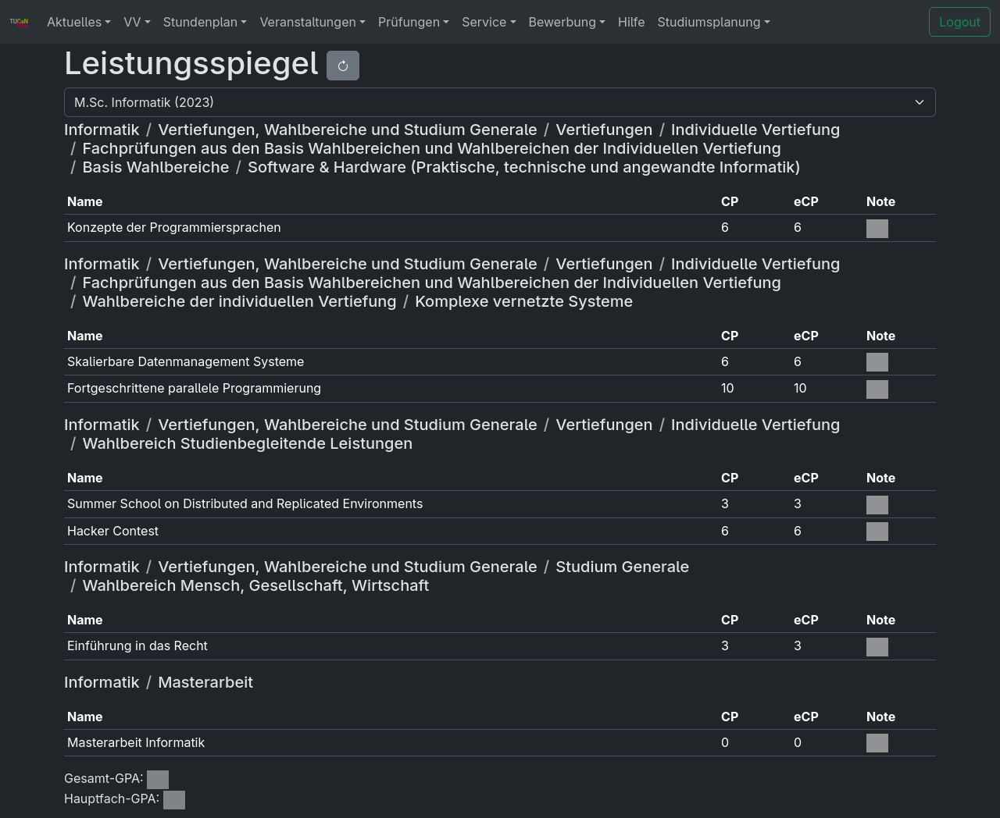

# TUCaN Plus


## Features

### Semesterplanung



### Custom UI



### Shareable URLs

TUCaN URLs are automatically fixed so you can open URLs shared by others.

## Installation

### Firefox on Desktop and Android (with autoupdates)

1. Download .xpi file from https://github.com/tucan-plus/tucan-plus/releases/latest

On Android continue with the following steps:
1. Go to Settings
2. Scroll all the way down and click on About Firefox
3. press the logo five times, it should say that the debug menu got activated
4. go back
5. Click on Install extension from file and select the downloaded .xpi file
6. If you have a Linux kernel version older than 4.16 follow the following steps to avoid extremely slow extension loads. Note that this can make other websites slow.
    1. Go to chrome://geckoview/content/config.xhtml
    2. Set javascript.options.wasm_optimizingjit to false

### Chromium on Desktop (with autoupdates)

1. Go to https://github.com/tucan-plus/tucan-plus/releases/latest
2. Right click on the .crx file and select "Save link as..." to download the extension file. Doing it this way is important, simply clicking on the link to download does not work as Chromium blocks the download.
2. In the Chromium Menu, go to Extensions -> Manage Extensions
3. Enable developer mode in the top right corner
4. Drag and drop the downloaded file into this area

### Edge Canary on Android

Chrome on Android unfortunately has no extension support but Edge Canary has.

1. Go to https://github.com/tucan-plus/tucan-plus/releases/latest and download the .crx file.
1. Open Settings, click on "About Microsoft Edge", then click five times on version number
2. Go back, go to "Developer options", click on "Extension install by crx", choose the downloaded file.

## Development

Requirements: [Rustup](https://www.rust-lang.org/tools/install)

Recommended: VSCodium with rust-analyzer extension

Just open the project in VSCodium.

### Run on Android

```
nix build -L .#extension-unpacked && (cd result && npx web-ext run --target firefox-android --android-device A209KFXV0201) # TODO make this build run a flake command
```

### Running all tests

```
PATH=$PATH:~/Downloads/chromedriver-linux64/:~/Downloads/chrome-linux64 EXTENSION_FILE=$PWD/tucan-plus-extension cargo test --package tucan-plus-tests desktop_chromium_main -- --nocapture
cargo test
```

### Running UI tests

**Important: Do NOT run in `nix develop` environment**

```
nix run .#test
```

### Formatting

We use a fork of rustfmt to format our custom html extractor macro.
```
# install minimal profile
rustup toolchain install nightly-2025-09-08 --component rust-src --component rustc-dev --component llvm-tools-preview
rustup component remove --toolchain nightly-2025-09-08 rustfmt
cargo +nightly-2025-09-08 install --force --git https://github.com/tucan-plus/rustfmt --branch html-extractor-formatting rustfmt-nightly
cargo +nightly-2025-09-08 fmt

rustup toolchain install nightly-2025-09-08 --component rustfmt
```

### Running as local webserver

```bash
cargo install dioxus-cli
cargo install --git https://github.com/DioxusLabs/dioxus.git --branch jk/workspace-hotpatch dioxus-cli
cargo install --path /home/moritz/Documents/dioxus/packages/cli dioxus-cli

cd crates/tucan-plus-dioxus/
dx serve --web --features api --verbose

ln -s /home/moritz/Documents/tucan-plus/target/dx/tucan-plus-dioxus/debug/web/public/ public
cargo run --manifest-path /home/moritz/Documents/dioxus/packages/cli/Cargo.toml serve --web --features direct --hot-patch --verbose --base-path public

https://developer.mozilla.org/en-US/docs/Mozilla/Add-ons/WebExtensions/Content_Security_Policy#scripts_from_localhost
```

### Developing the extension

```
cd crates/tucan-plus-dioxus/
dx bundle --platform web --out-dir ../../tucan-plus-extension/ --base-path public --features direct --release
sed -i 's/importMeta.url/import.meta.url/g' ../../tucan-plus-extension/public/assets/tucan-plus-dioxus-*.js
```

Go to Firefox Extensions, click settings, debug addons. Then click load temporary add-on and select ./tucan-plus-extension/manifest.json
See https://extensionworkshop.com/documentation/develop/debugging/.

## Building extension (not for development)

```bash
podman build --output . .
```
This will produce a tucan-plus-extension.zip in the current working directory.

## Packaging

### Chromium

https://developer.chrome.com/docs/extensions/how-to/distribute/host-on-linux#packaging

Open Chromium -> chrome://extensions/ -> Pack extension -> Choose folder -> Pack. Store private key in a secure place

```bash
chromium --pack-extension=tucan-plus-extension --pack-extension-key=/path/to/tucan-plus-extension.pem
```

### Firefox

https://extensionworkshop.com/documentation/publish/distribute-sideloading/

ZIP the extension files.

Upload to AMO as unlisted extension and pray that it gets signed quickly.

## How does it work

This software consists of the tucan-connector component that extracts information from the html of [TUCaN](https://www.tucan.tu-darmstadt.de) and provides it as a nicer to use programming API. The tucan-injector component can then be used to show that data with a nicer UI that is written using the Rust frontend library [Dioxus](https://dioxus.dev/) and that is compiled to [WebAssembly](https://webassembly.org/). This WebAssembly can be injected into the actual TUCaN website using an extension. Then, some pages provide an overlay with the information in a nicer format and caching.

## API

```
bacon tucan-plus-api
```
http://localhost:3000/swagger-ui/

http://localhost:3000/api-docs/openapi.json

```
cargo run --bin schema > schema.json
```
https://editor-next.swagger.io/

## tucan-connector

## Debugging

https://chromewebstore.google.com/detail/cc++-devtools-support-dwa/pdcpmagijalfljmkmjngeonclgbbannb

## CI

Use a GitHub self-hosted runner with e.g. Ubuntu and Nix installed (so no NixOS).

Important: Enable "Require approval for all outside collaborators"

https://docs.github.com/en/actions/reference/security/secure-use#hardening-for-self-hosted-runners

Install gh, jq and docker on the runner.
